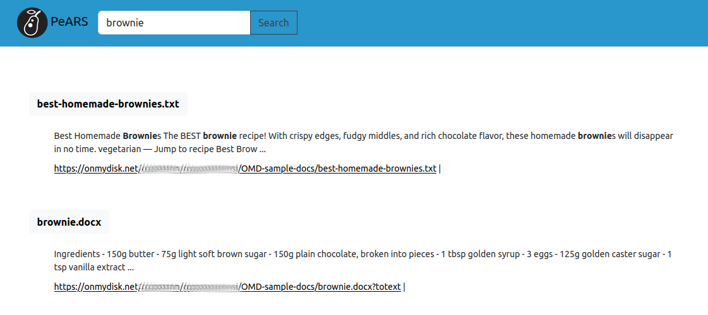

<!--
SPDX-FileCopyrightText: 2024 PeARS Project, <community@pearsproject.org> 

SPDX-License-Identifier: AGPL-3.0-only
-->

# PeARS Lite - OMD integration


## Executive summary

**What:** *PeARS-OMD* is a version of PeARS used in the context of the project *On My Disk: search integration*. A description of the project can be found [on this page](https://www.ngisearch.eu/view/Events/FirstTenSearchersAnnounced). We are grateful to the Next Generation Internet programme of the European Commission for the financial support given to this project (see credits at the bottom of this README).

This PeARS version is tailored for use with the [On My Disk](https://onmydisk.com/) private cloud solution. It includes features for indexing and search over a user's decentralised filesystem. It also provides search over the websites decentrally hosted on the On My Disk network.

You can only use PeARS-OMD if you have an On My Disk account. You can create an account at: https://onmydisk.net/signup. Next, you will need to install a client so that you can add local folders to On My Disk. Download a client appropriate for your system here: https://onmydisk.com/downloads.html and follow the installation instructions. Once your client is installed, add some folders from your local drive -- these are now accessible from anywhere in the world using the On My Disk web client, and, importantly, they are now ready to be indexed using PeARS.


## Installation and Setup

PeARS-OMD is meant to be run privately on a local machine. The next steps explain how to run the system on a local port and connect it to an On My Disk account.

#### Prerequisites

We will assume that you have an On My Disk client installed on your machine and accessible at *localhost*. Please see the On My Disk set up instructions if you do not have the client yet.

You will have to set up the client for use with PeARS, by navigating to your settings and to the device tab. Please tick 'Use local PeARS server' and enter a string of your choice as authentification token.


#### 1. Clone this repo on your machine:

```
    git clone https://github.com/PeARSearch/PeARS-OMD.git
```

#### 2. **Optional step** Setup a virtualenv in your directory.

If you haven't yet set up virtualenv on your machine, please install it via pip:

    sudo apt update

    sudo apt install python3-setuptools

    sudo apt install python3-pip

    sudo apt install python3-virtualenv

Then change into the PeARS-OMD directory:

    cd PeARS-OMD

Then run:

    virtualenv env && source env/bin/activate


#### 3. Install the build dependencies:

From the PeARS-lite directory, run:

    pip install -r requirements.txt


#### 4. Set up authentification

Copy the *conf/pears.ini.template* file to your own *conf/pears.ini*. This file will contain your secret tokens for authentification and security.

    cd conf
    cp pears.ini.template pears.ini

You should change the following lines:

    # Secrets
    AUTH_TOKEN=<your token, identical to the one in the OMD client>
    SESSION_COOKIE_NAME=<some session name>
    CSRF_SESSION_KEY=<some long string>
    SECRET_KEY=<some long string>

The last three lines can be set to any long string of your choice. The first line, AUTH_TOKEN, should be set to the string that you chose in your On My Disk client, under 'Use local PeARS server'.

#### 5. Choose your languages

The list of available languages is also set in *conf/pears.ini*. Currently, the languages that are available out-of-the-box are English, French, Russian, and Slovenian. If you would like all of these language to be available, enter "en,fr,ru,sl" as the value. Please note that the order of the language matters for certain things: it plays a role in the ordering of search results, and the first language in the list is used as a fallback if `langdetect` can't recognize a document's language as one of the installed languages.  

#### 6. Run your pear!

To start PeARS, run:

```
python3 run.py
```

You should now see the login page of PeARS at http://localhost:9090/; use your On My Disk credentials to sign in.


#### 7. Indexing & searching

Your PeARS is set up to index your private files, as well as the public websites hosted on the On My Disk network. These two functions can be accessed under the tabs 'private' and 'websites' respectively.

##### Private indexing

The first thing you will want to do on your private indexer page is retrieve your account information from the On My Disk gateway. To do this, simply click on 'Update your database'. It will populate the page with your personal information.


Under 'Subscriptions: locations', you will find the physical devices you have registered on the OnMyDisk network, as well as any folder shared with you by other users. By default, each location is unticked, meaning that PeARS will not index it. If you want to index a specific location, you can do so by ticking the relevant checkbox and pressing the button 'Update subscriptions'. Next time you run your indexer, that location will be included in the indexing.

Under 'Subscriptions: groups', you will find a list of all the groups you belong to. By default, your PeARS install will index all groups for the locations you are subscribed to. If you wish to exclude a group from indexing, simply untick it here, and click on 'Update subscriptions'.

Once you have selected the locations and groups you wish to index /not index, you can click on 'index all subscribed content'. Your PeARS will retrieve your documents from all relevant physical locations and build a searchable index for them.

##### Website indexing

On My Disk is not just a private cloud service, but also a private website hosting service. People hosting their website on the On My Disk network can have their public content directly searchable from local PeARS nodes. In order to know which websites are available on the network, head over to the Websites tab and click on 'Browse the current list':


If you don't see any websites, click on 'Pull new websites from the On My Disk network'. You should be presented with the current list of all sites on the network:


To make a site searchable on your local PeARS client, simply click on the little cloud icon. This will add the site to your subscribed content. The list of sites you are subscribed to is visible from the 'Websites' tab. Whenever you want to unsubscribe from a site, you can untick the relevant checkbox and click on 'Update subscriptions'.


As for private indexing, clicking on 'index all subscribed content' will trigger indexing for all your locations, including subscribed websites.

#### 8. Searching!

Once indexing is complete, you can search. Results will look like this:



The system will search both your files' metadata as well as their full text, if applicable: the contents from plain text files will be indexed directly; the contents of certain supported file types (`pdf``, `odt`, `docx`, `xlsx`, and `pptx`) will be automatically converted and made searchable.


#### 9. Cleaning your environment
Whenever you want to come back to a clean install, manually delete your database and pods:

```
rm -f app/db/app.db
rm -fr app/pods/*
```


## Credits


Funded by the European Union. Views and opinions expressed are however those of the author(s) only and do not necessarily reflect those of the European Union or European Commission. Neither the European Union nor the granting authority can be held responsible for them. Funded within the framework of the NGI Search project under grant agreement No101069364.
